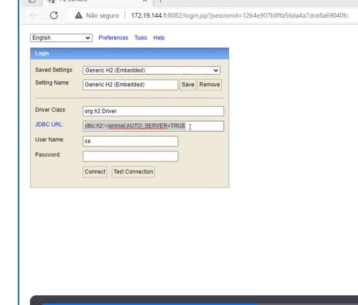
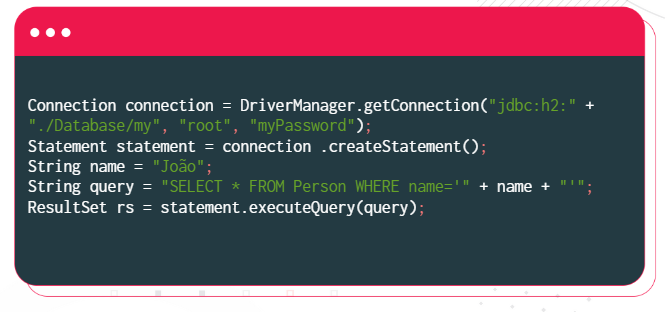
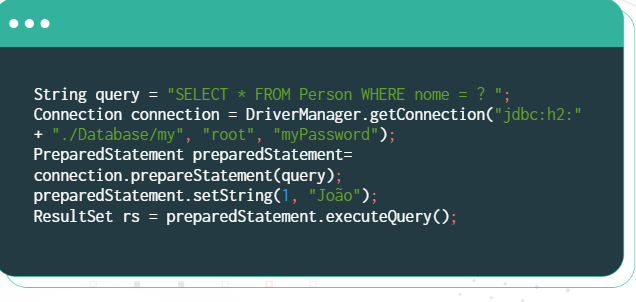
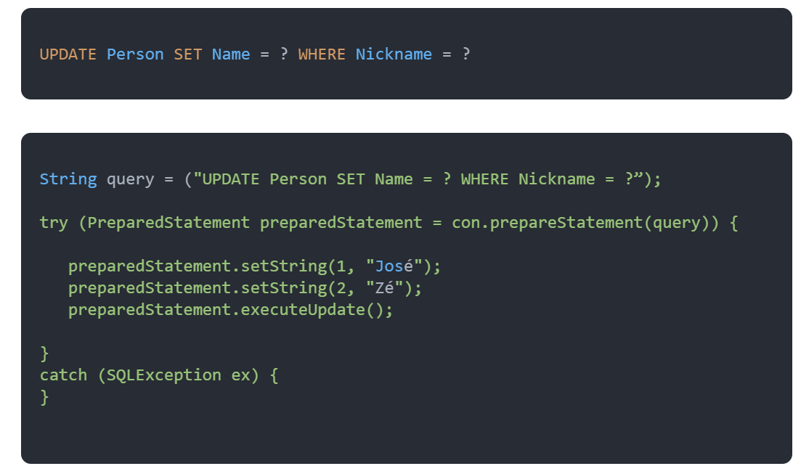
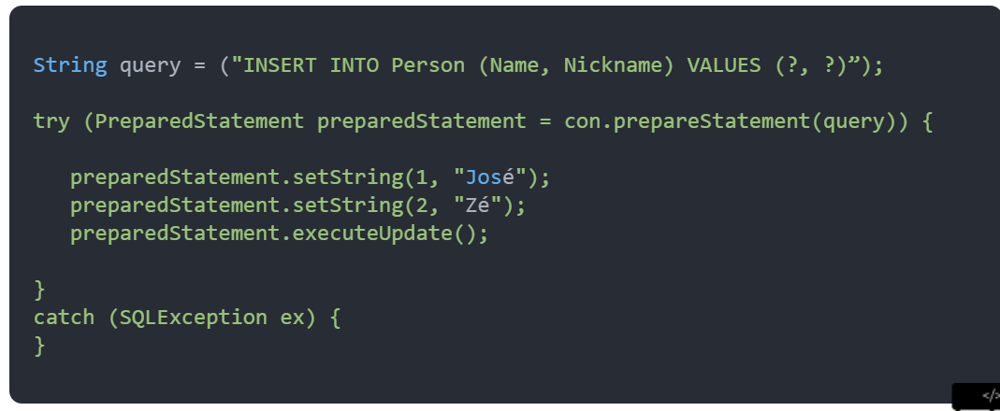
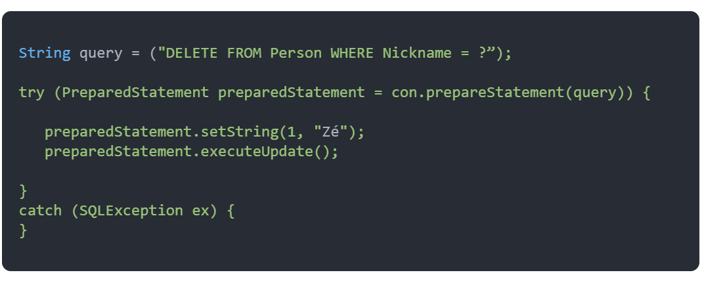

# javaConexaoBancoDeDados

### Acesso a Banco de Dados

* JDBC
  * O JDBC, sigla para Java DataBase Connectivity, é uma API de nível de chamada que disponibiliza diversas interfaces
  e algumas classes de suporte para conectividade com o banco de dados. A ideia do JDBC é que se possa criar e 
  implementar suas próprias estruturas de acordo com a sua necessidade. Por se tratar de um conjunto de interfaces,
  qualquer código executado pelo JDBC  que implemente corretamente sua interface não será afetado no caso de alteração
  do seu código.

* DRIVERS
  * Cada driver é um pacote de classes que devemos incor´porá-lo como uma biblioteca em nosso programa Java. Portanto, as
classes que implementam as interfaces do driver precisam estar disponíveis no CLASSPATH. Embora seja possivel fazer isso
  manualmente, normalmente fazemos isso por meio da IDE.
  
* ETAPAS
  * Carregar o driver
  * Abrir uma conexão
  * Executar uma instrucao SQL
  * Encerrar a conexão

### H2
* O H2 é um banco de dados de código aberto escrito em Java que pode ser integrado a aplicações Java ou excutado no
modo cliente-servidor.
Seu principal uso é quando configutado para ser executado em memória, desta forma, os dados não serão
gravados em disco, pois o banco de dados não será utilizado em produção, mas para uso em desenvolvimento e
testes.

### Utilizando JDBC Prepared Statement
* A primeira coisa que precisamos saber é a diferença entre uma instrução (statement) e uma instrução
  preparada (prepared statement). Quando construímos uma consulta JDBC, devemos elaborar uma instrução, 
  ou sentença, que será responsável por definir a consulta SQL a ser executada pelo motor (engine) do 
  banco de dados.

* statement - Neste caso, estamos construindo uma sentença e informando um parametro para a consulta de forma
dinamica. Isso basicamente se torna uma consulta SQL que executamos por meio do driver JDBC no banco de dados.
  

* prepared statement - Para duas consultas diferentes, dois planos de execução diferentes sao criados, embora
ambas as consultas sejam realmente muito semelhantes e apenas se modifica o valor do parametro que informamos.
  
  Para solucionar esse problema é que existe o JDBC Prepared Statement. Essas estruturas permitem manter
  as consultas neutras sem considerar os valores de parametro que informamos, uma vez que realiza a ligacao
  (binding) dos valores.
  

### Modificar dados com PrepareStatement

* UPDATE
  * devemos preparar nossa query e adicionar o caractere de interrogação (?) como valor para o dado que 
  queremos atualizar. E o método executeUpdate() que executará nossa query retorna um inteiro indicando 
  o número de linhas afetadas pela modificação. Por exemplo:
  

* INSERT

* DELETE

### Transações
* Uma transação é um conjunto de operações em um banco de dados que deve ser executado como uma unidade.
Há ocasioes em que é necessário a realização de várias operações no banco de dados como um único bloco, ou
seja, que sejam executadas todas as operações ou nenhuma, mas que não realize apenas algumas dessas operações.

* Se forem executadas parcialmente até o momento em que uma operação falhar, o estado dos dados no banco de dados
podem ficar inconsistentes. Nesse caso precisamos de um mecanismo para devolve-lo ao estado anterior,
podendo desfazer todas as operações realizadas.

* Um objeto Connection por padrão executa automaticamente tidas as operacoes no banco de dados. Isso significa
que toda vez que uma instrução é executada, ele é ferletida no banco de dados e não pode ser desfeita. Por 
padrão, o modo auto-commit na conexão está habilitado.

* Os seguintes metodos na interface de conexão (Connection) são usados para gerenciar transações no banco de dados
  * void setAutoCommit(boolean valor) - para transação setar como false
  * void commit()
  * rollback()
